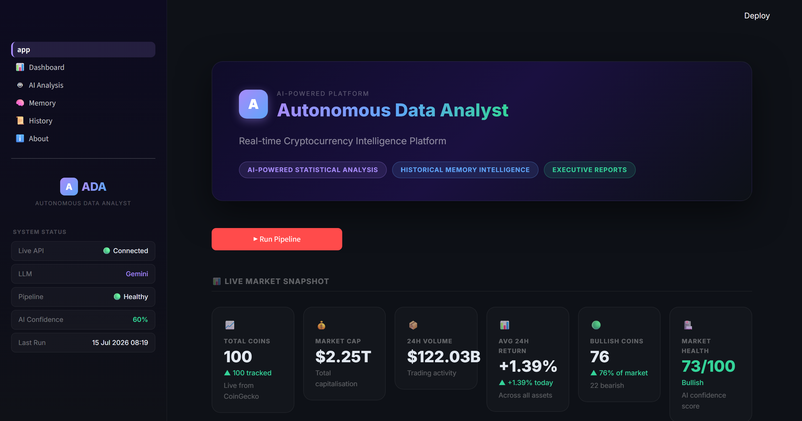
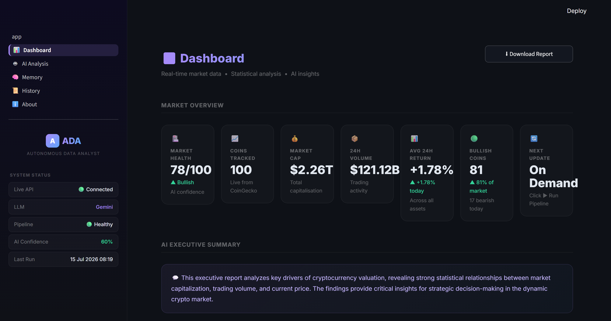
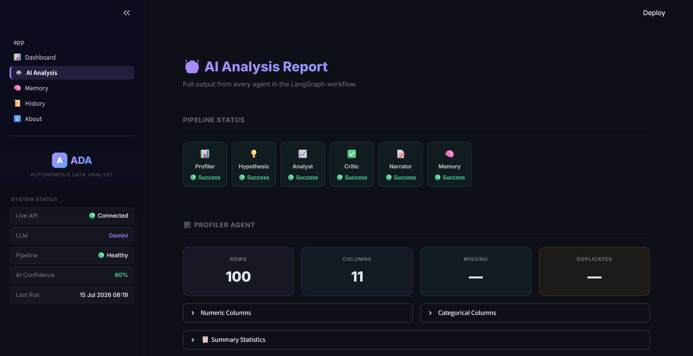
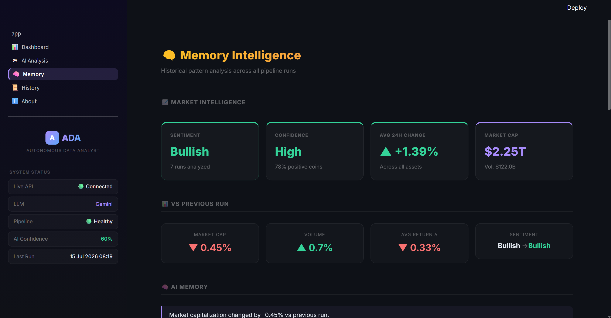
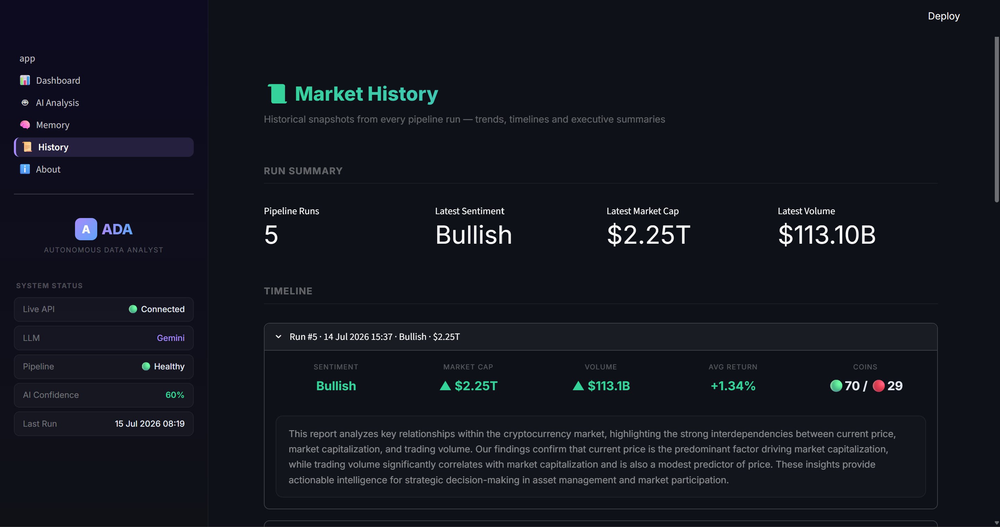
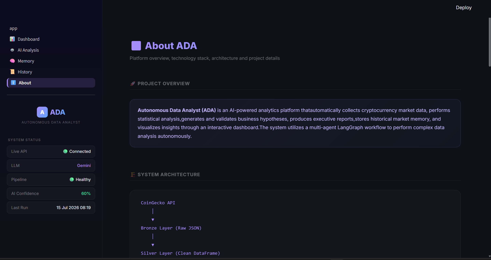

# 🤖 Autonomous Data Analyst

> An AI-powered Multi-Agent Analytics Platform that automatically collects live cryptocurrency market data, performs statistical analysis, generates business hypotheses, validates insights, builds executive reports, remembers historical market trends, and visualizes everything through an interactive Streamlit dashboard.


---

# 🚀 Overview

Autonomous Data Analyst is an AI-powered analytics platform that automates the complete business intelligence workflow.

Instead of manually exploring datasets, the platform employs multiple AI agents that collaborate to:

- Collect live cryptocurrency market data
- Profile datasets automatically
- Generate statistical business hypotheses
- Execute statistical analysis
- Validate analytical results
- Generate executive business reports
- Store historical market intelligence
- Compare historical trends
- Present everything in an interactive dashboard

The project combines modern Data Engineering, Business Intelligence, Statistics, Generative AI, and Agentic AI into a unified analytics platform.


---

# ✨ Features

## 📡 Live Data Collection

- CoinGecko API Integration
- Live Cryptocurrency Market Data
- Automated ETL Pipeline
- Bronze → Silver Architecture

---

## 📊 Data Engineering

- Automated Data Cleaning
- Feature Engineering
- SQLite Data Warehouse
- Historical Market Storage

---

## 🤖 Multi-Agent AI Workflow

The project uses a LangGraph-based Agentic AI workflow consisting of six specialized agents.

### 📊 Profiler Agent

- Dataset Profiling
- Missing Value Detection
- Duplicate Detection
- Correlation Analysis
- Outlier Detection
- Summary Statistics

---

### 💡 Hypothesis Agent

Powered by Google Gemini.

Automatically generates statistically testable business hypotheses based on the dataset profile.

Examples:

- Price vs Market Cap
- Volume vs Market Cap
- Rank vs Price
- Correlation Analysis
- Regression Problems

---

### 📈 Analyst Agent

Executes statistical tests including:

- Pearson Correlation
- Spearman Correlation
- Linear Regression
- T-Test
- ANOVA

---

### ✅ Critic Agent

Reviews every analytical result.

Checks:

- Statistical correctness
- Business relevance
- Confidence level
- Recommendation quality

Only approved insights move forward.

---

### 📝 Narrator Agent

Transforms statistical outputs into executive-level business reports.

Generates:

- Executive Summary
- Key Findings
- Business Recommendations
- Final Conclusion

---

### 🧠 Memory Agent

Stores every market snapshot inside SQLite.

Tracks:

- Market Capitalization
- Trading Volume
- Bullish/Bearish Trend
- Historical Executive Reports

Allows historical comparison across pipeline executions.

---

# 🏗 Project Architecture

```
                 CoinGecko API
                       │
                       ▼
              Bronze Data Layer
                       │
                       ▼
              Silver Data Layer
                       │
                       ▼
             SQLite Data Warehouse
                       │
                       ▼
               LangGraph Workflow
                       │
      ┌───────────┬─────────────┬─────────────┐
      ▼           ▼             ▼             ▼
 Profiler   Hypothesis     Analyst       Critic
      │
      ▼
  Narrator
      │
      ▼
   Memory Agent
      │
      ▼
 Streamlit Dashboard
```

---

# 📷 Application Screenshots

## 🏠 Application Overview



---

## 📊 Cryptocurrency Dashboard

Live cryptocurrency KPIs, AI executive summary, key findings, recommendations, and market insights.



---

## 🤖 AI Analysis Report

Displays the complete LangGraph workflow including Profiler, Hypothesis, Analyst, Critic, Narrator, and Memory Agents.



---

## 🧠 Memory Agent

Compares the latest market snapshot with previous pipeline executions and tracks historical market intelligence.



---

## 📜 Market History

Historical market trends, pipeline executions, sentiment evolution, and executive summaries across runs.



---

## ℹ️ About the Project

Project architecture, AI workflow, technology stack, features, and overall system design.



# 📂 Project Structure

```
autonomous-data-analyst/

├── agents/
├── config/
├── data/
│   ├── bronze/
│   └── silver/
├── database/
├── images/
├── ingestion/
├── memory/
├── models/
├── orchestrator/
├── pages/
├── reports/
├── ui/
├── utils/
├── warehouse/
│
├── app.py
├── requirements.txt
├── README.md
└── .env.example
```

---

# 📊 Dashboard Modules

## 📊 Dashboard

- Live KPIs
- Market Capitalization
- Trading Volume
- Executive Summary
- AI Recommendations

---

## 🤖 AI Analysis

Displays outputs from every AI Agent:

- Profiler
- Hypothesis
- Analyst
- Critic
- Narrator
- Memory

---

## 🧠 Memory

Historical comparison between the latest and previous market snapshots.

---

## 📜 History

Tracks historical pipeline executions.

---

## ℹ About

Complete architecture, technology stack, workflow and project details.

---

# 🛠 Technology Stack

## Backend

- Python
- Pandas
- NumPy
- SciPy
- Statsmodels
- SQLite
- Requests

---

## AI

- Google Gemini
- LangGraph
- Prompt Engineering

---

## Frontend

- Streamlit
- Plotly

---

## Database

- SQLite

---

## APIs

- CoinGecko API

---

# ⚙ Installation

Clone the repository

```bash
git clone https://github.com/swapitsneil/autonomous_data_analyst.git
```

Move into the project

```bash
cd autonomous_data_analyst
```

Install dependencies

```bash
pip install -r requirements.txt
```

Create a `.env` file

```env
GEMINI_API_KEY=YOUR_GEMINI_API_KEY
COINGECKO_API=YOUR_COINGECKO_API_KEY
```

Run the ETL Pipeline

```bash
python -m ingestion.api_loader
```

Launch the Streamlit application

```bash
streamlit run app.py
```

---

# 📈 Example Workflow

```
Fetch Live Market Data

↓

Clean & Transform Dataset

↓

Store in SQLite

↓

Profiler Agent

↓

Hypothesis Agent

↓

Analyst Agent

↓

Critic Agent

↓

Narrator Agent

↓

Memory Agent

↓

Interactive Dashboard
```

---

# 🔮 Future Roadmap

- PDF Executive Report Export
- Multi-Dataset Support (CSV, Excel, SQL)
- Smarter Temporal Memory
- Visualization Agent
- Auto Dashboard Generation
- Scheduled Pipeline Execution
- Docker Deployment
- Cloud Database Support
- User Authentication

---

# 👨‍💻 Developer

**Swapnil Nicolson Dadel**

Generative AI  Data Analyst

- 💼 LinkedIn: https://www.linkedin.com/in/swapnildadel/
- 🐙 GitHub: https://github.com/swapitsneil

---

# ⭐ Support

If you found this project useful, consider giving it a ⭐ on GitHub.
